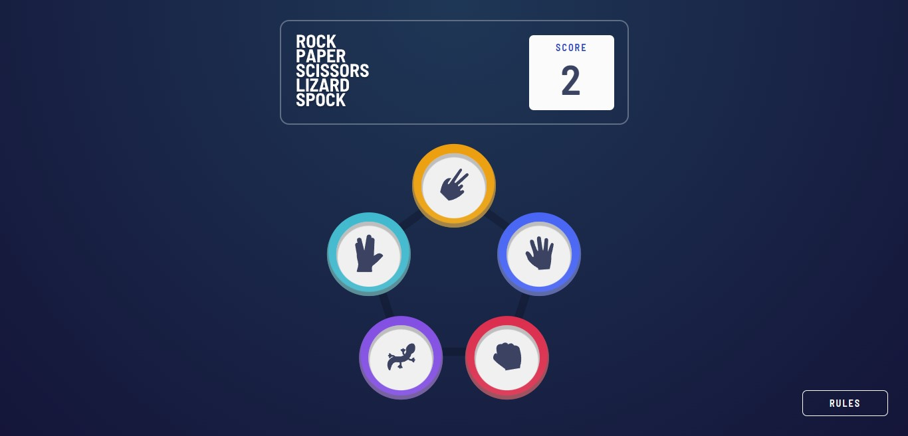

# Project using React JS

This project is a solution for [Frontend Mentor's challenge](https://www.frontendmentor.io/challenges/rock-paper-scissors-game-pTgwgvgH).

## Table of contents

- [Overview](#overview)
  - [The challenge](#the-challenge)
  - [Screenshot](#screenshot)
  - [Links](#links)
- [My process](#my-process)
  - [Built with](#built-with)
  - [Personal notes](#personal-notes)
- [Author](#author)

## Overview

This challenge is to build out Rock, Paper, Scissors game and get it looking as close to the design as possible.

### The challenge

In this project, users will be able to:

- View the optimal layout for the game depending on their device's screen size
- Play Rock, Paper, Scissors, Lizard, Spock against the computer
- Maintain the state of the score after refreshing the browser

### Screenshot

### Links

- Solution URL: [Frontend Mentor Solution Page](https://www.frontendmentor.io/solutions/rock-paper-scissors-game-j8C7mVAiYr)
- Live Site URL: [Rock Paper Scissor Spock Lizard Game](https://rock-paper-scissors-master-kiflanadli.vercel.app/)

## My process

### Built with

- React js
- SCSS
- Localstorage
- Flexbox
- CSS Grid

### Personal notes

There is some responsiveness issue when the page being view with desktop screen (> 1400px width), the layout isn't vertically centered enough. So I'd like to improve those in the future using ways such as flex column.

## Author

- Website - [Kiflan Adli](https://kiflanadli.github.io)
- Frontend Mentor - [@kiflanadli](https://www.frontendmentor.io/profile/kiflanadli)
